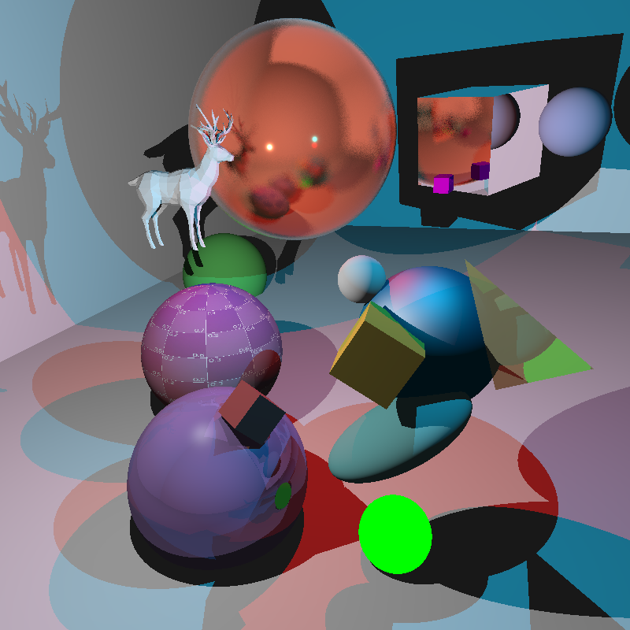

# raytracing

A ray tracer written in Rust which implements Blinn-Phong shading and physically-based rendering using a Metallic-Roughness workflow

#### References
- [_Physically Based Rendering: From Theory To Implementation_](http://www.pbr-book.org/)
- [Scratchapixel](https://www.scratchapixel.com)
- https://bheisler.github.io/post/writing-raytracer-in-rust-part-1/
- [three.js](https://threejs.org/)

### Building/Running

*Make sure [Rust and `cargo`](https://www.rust-lang.org/learn/get-started) are installed.*

- For a live visualization of the ray tracer, run `cargo run -- scenes/scene.json`
- To output to a file, run `cargo run -- -o image.png scenes/scene.json`

*Additional scene files are in the [scenes](./scenes) folder*

### Renders

Other renders can be found in the [renders](./renders/renders.md) folder.

`scenes/scene.json` (800 x 800 pixels (4 spp), 1,523 primitives, 39,508,885 rays, 14.413s on i7 8650U):



----

#### raytrace usage

The following options may be passed through `cargo` like so: `cargo run -- [FLAGS] [OPTIONS] <scene>`

```
ray tracer
A ray tracer written in Rust

USAGE:
    raytrace [FLAGS] [OPTIONS] <scene>

FLAGS:
    -h, --help           Prints help information
        --no-progress    Hide progress bar
    -V, --version        Prints version information

OPTIONS:
    -o, --output <output>    Output rendered image to file
                             If omitted, image is rendered to a window

ARGS:
    <scene>    input scene as a json file
```
