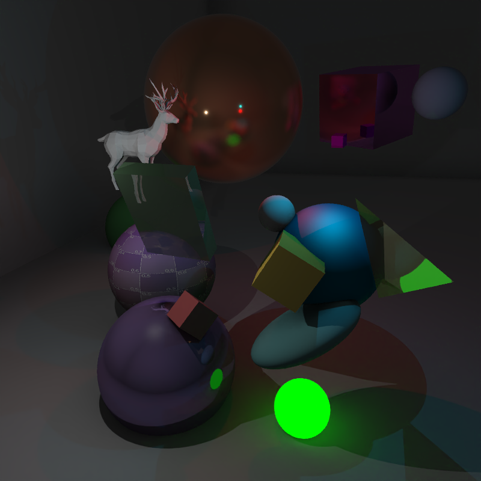
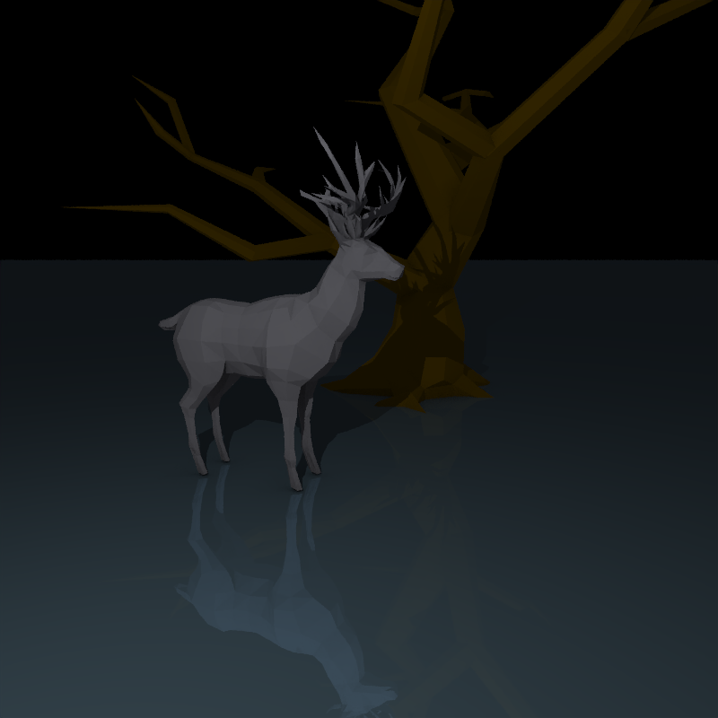

# Rendered scenes

_spp = samples per pixel_

#### `scenes/scene.json`

800 x 800 pixels (4 spp), 1,524 primitives, 112,801,435 rays, 30.181s on i7 8650U

#### `scenes/mesh.json`

800 x 800 pixels (8 spp), 2,269 primitives, 70,711,412 rays, 11.358s on i7 8650U

#### `scenes/refraction.json`

800 x 800 pixels (4 spp), 6 primitives, 188,983,328 rays, 12.504s on i7 8650U

#### `scenes/physical.json`

800 x 800 pixels (4 spp), 50 primitives, 453,366,121 rays, 45.227s on i7 8650U

#### `scenes/mesh_test.json`

800 x 800 pixels (4 spp), 41,372 primitives, 39,250,659 rays, 8.670s on i7 8650U

#### `scenes/occlusion.json`

800 x 800 pixels (4 spp), 9 primitives, 47,779,318 rays, 3.716s on i7 8650U

#### `scenes/test.json`

800 x 800 pixels (4 spp), 9 primitives, 35,718,528 rays, 2.984s on i7 8650U

# Model credits
- [Utah teapot](https://en.wikipedia.org/wiki/Utah_teapot)
- [Low Poly Deer](https://free3d.com/3d-model/low-poly-deer-72513.html) by snippysnappets
- [lowpoly tree](https://www.turbosquid.com/3d-models/free-tree-3d-model/592617) by stanloshka
- [Cerberus(FFVII Gun) model](http://www.polycount.com/forum/showthread.php?t=130641) by Andrew Maximov
