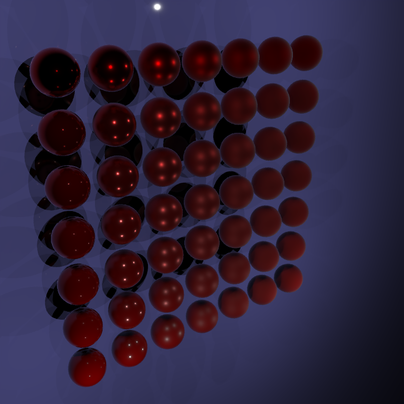
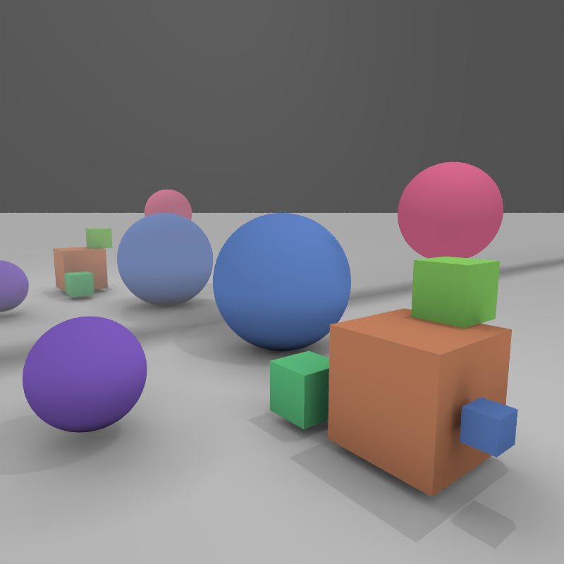

# Rendered scenes

_spp = samples per pixel_

#### `scenes/scene.json`

800 x 800 pixels, 4 spp, 1,524 primitives, 147,115,715 rays, 51.451s on i7 8650U

#### `scenes/mesh.json`

800 x 800 pixels, 4 spp, 2,269 primitives, 38,326,926 rays, 10.382s on i7 8650U

#### `scenes/refraction.json`

800 x 800 pixels, 4 spp, 6 primitives, 229,283,763 rays, 15.855s on i7 8650U

#### `scenes/physical.json`

800 x 800 pixels, 4 spp, 50 primitives, 533,716,349 rays, 59.993s on i7 8650U

#### `scenes/mesh_test.json`

800 x 800 pixels, 4 spp, 41,372 primitives, 41,492,072 rays, 15.210s on i7 8650U

#### `scenes/occlusion.json`

800 x 800 pixels, 4 spp, 9 primitives, 54,222,719 rays, 5.168s on i7 8650U

#### `scenes/emissive.json`

800 x 800 pixels, 4 spp, 15 primitives, 31,854,333 rays, 3.949s on i7 8650U

#### `scenes/test.json`

800 x 800 pixels, 4 spp, 9 primitives, 35,707,210 rays, 3.914s on i7 8650U

# Model credits

- [Utah teapot](https://en.wikipedia.org/wiki/Utah_teapot)
- [Low Poly Deer](https://free3d.com/3d-model/low-poly-deer-72513.html) by snippysnappets
- [lowpoly tree](https://www.turbosquid.com/3d-models/free-tree-3d-model/592617) by stanloshka
- [Cerberus(FFVII Gun) model](http://www.polycount.com/forum/showthread.php?t=130641) by Andrew Maximov
